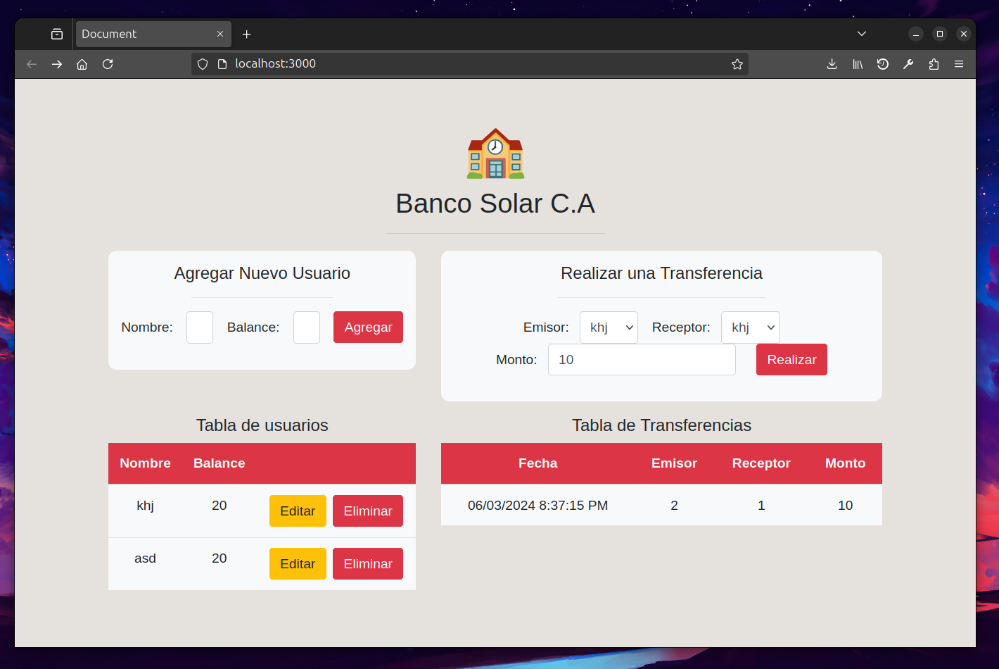

# Prueba Banco Solar

En esta prueba validaremos nuestros conocimientos de Conectar una base de datos
PostgreSQL con Node, Realizar consultas DML con Node y el paquete pg, Realizar consultas
TCL con Node y el paquete pg, Construir una API RESTful utilizando PostgreSQL para la
persistencia de datos, Manejar errores y Manejar códigos de estado HTTP.

### Para inicializar el programa se requiere:

1. Instalar las dependencias usadas con el comando `npm i`.
2. Se requiere crear una base de datos en postgres usando las consultas en la carpeta SQL.
3. Crear un archivo `.env` con las variables de entorno necesarias (PORT, DB_USER, DB_PASSWORD, DB_HOST, DB_PORT, DB_NAME).
4. Se requiere ejecutar el programa con el comando `npm run dev`.

Imagen de la aplicación:

## Josué Gallardo - g68 Bootcamp Talento Digital - Desafío Latam
